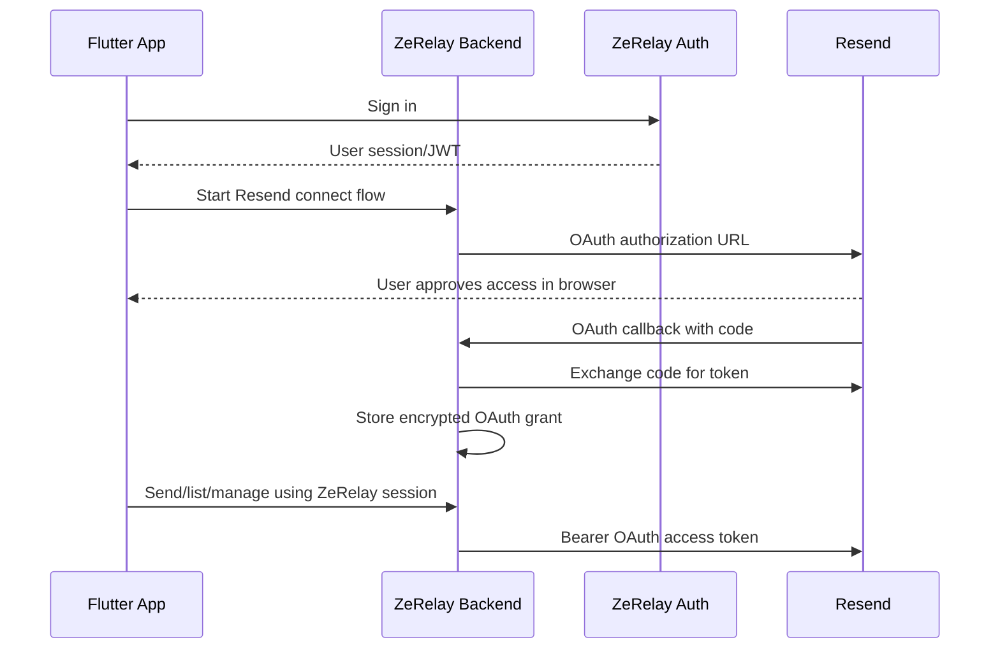

# Resend Integration

ZeRelay is a mobile workspace for Resend. Because this is a mobile app, the client must never call Resend directly with a long-lived secret.

## Current codebase status

The repository currently contains:

- Flutter mobile UI using Riverpod mock/local state (`lib/providers/state.dart`).
- Next.js backend route handlers under `backend/app/api/resend/`.
- No production Supabase Auth/session validation wired yet.
- No persistent encrypted credential database wired yet; backend credential stores are in-memory development shims.

## Recommended production connection model



## OAuth support

OAuth is the preferred mobile-safe model because ZeRelay can identify the signed-in user and keep Resend credentials on the backend.

The backend includes OAuth-ready routes:

| Route | Purpose |
| --- | --- |
| `GET /api/resend/oauth/start` | Starts OAuth and returns an authorization URL. |
| `GET /api/resend/oauth/callback` | Exchanges the authorization code and stores the grant. |
| `GET /api/resend/oauth/status` | Returns whether the user is connected and by which method. |
| `POST /api/resend/oauth/disconnect` | Removes the stored OAuth grant/fallback API key. |

These routes intentionally require explicit environment configuration. Do not guess or hardcode undocumented Resend OAuth endpoints.

Required env when Resend OAuth app credentials are available:

```env
RESEND_OAUTH_AUTHORIZATION_URL=
RESEND_OAUTH_TOKEN_URL=
RESEND_OAUTH_CLIENT_ID=
RESEND_OAUTH_CLIENT_SECRET=
RESEND_OAUTH_REDIRECT_URI=https://your-backend.com/api/resend/oauth/callback
RESEND_OAUTH_SCOPES="emails:send domains:read domains:write webhooks:write"
RESEND_OAUTH_SUCCESS_REDIRECT=zerelay://resend/oauth/success
RESEND_OAUTH_ERROR_REDIRECT=zerelay://resend/oauth/error
RESEND_USER_AGENT=ZeRelayBackend/1.0
```

Until Resend provides app credentials/endpoints for ZeRelay, these routes return `501` rather than pretending OAuth is configured.

## Temporary API-key fallback

For local/MVP testing only, the backend supports storing a user-provided Resend API key once via:

- `GET /api/resend/credentials`
- `POST /api/resend/credentials`
- `DELETE /api/resend/credentials`

The Flutter app should not send this key on every Resend API call. The backend looks up the user credential using `x-user-id` in the current mock build.

Production replacement:

1. Validate a Supabase Auth JWT instead of trusting `x-user-id`.
2. Store credentials in Supabase Postgres encrypted at rest.
3. Enforce workspace membership/RBAC before each Resend call.
4. Prefer OAuth grants over raw API keys.

## Resend proxy endpoints

All proxy calls include the required Resend `User-Agent` header.

| Route | Upstream Resend API |
| --- | --- |
| `POST /api/resend/send` | `POST /emails` |
| `GET /api/resend/domains` | `GET /domains` |
| `POST /api/resend/domains` | `POST /domains` |
| `PATCH /api/resend/domains` | `PATCH /domains/{id}` |
| `DELETE /api/resend/domains?id=...` | `DELETE /domains/{id}` |
| `POST /api/resend/domains/verify` | `POST /domains/{id}/verify` |
| `POST /api/resend/webhooks` | Receives Resend events |
| `POST /api/resend/webhooks/{token}` | Receives Resend events with a user/workspace token |

## Webhook verification

Webhook handling uses Svix-style headers when `RESEND_WEBHOOK_SIGNING_SECRET` is configured:

- `svix-id`
- `svix-timestamp`
- `svix-signature`

If the env var is missing, the development handler logs a warning and accepts payloads. Set the signing secret in production.

## Security rules

- The Flutter app never calls `https://api.resend.com` directly.
- Long-lived secrets never ship in the mobile bundle.
- OAuth grants/API keys must be stored server-side only.
- Backend auth must be a real session/JWT, not `x-user-id`, before production.
- Every Resend operation must be workspace-scoped and permission-checked.
